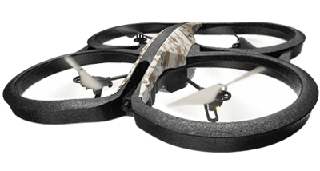

# :rocket: N-Dronao :rocket:

[](https://travis-ci.org/baumannzone/n-dronao)
[](https://snyk.io/test/github/baumannzone/dronappi)

Basic webapp to control a  Parrot AR Drone 2.0 quad-copter via browser :computer:. Uses `pug` (formerly known as `jade`) as template engine, 
some markdown to html converter, and of course, `node.js`.

## Getting Started

### Prerequisites

One Parrot AR.Drone v2 (may work with v1 too). [Link here](https://www.parrot.com/us/drones/parrot-ardrone-20-elite-edition#parrot-ardrone-20-elite-edition-details "ar-drone") 



You need `node.js` (and `npm`) installed in your computer.

Check it out, you should see something like this in your console:
#### node.js
```
→ node -v
v4.2.6
```  

#### npm
```
→ npm -v
3.9.6
```

### Installing

```
→ git clone https://github.com/baumannzone/dronAPPi.git
```
  
Open proyect folder 
```
→ cd dronAPPi
```
  
Install project dependencies
```
→ npm install
```
  
Run the app
```
→ node server.js
```
  
:space_invader: Finally, in your browser, go to [http://localhost:8088](http://localhost:8088) 


### Node compatibility

This has been tested with node 4.2. However, it should work with previous versions.


## Built With

* [express.js](https://expressjs.com/) - Fast, unopinionated, minimalist web framework for node.js
* [Pug](https://pugjs.org) – robust, elegant, feature rich template engine for node.js 
* [Showdown](http://showdownjs.github.io/demo/) - A Markdown to HTML converter written in Javascript 


## Versioning

We use [SemVer](http://semver.org/) for versioning. For the versions available, see the [tags on this repository](https://github.com/baumannzone/dronAPPi/tags). 


## Authors

* **Jorge Baumann** - [@baumannzone](https://twitter.com/baumannzone) - [Website](http://baumannzone.com)


## License

This project is licensed under the MIT License - see the [license.md](license.md) file for details
